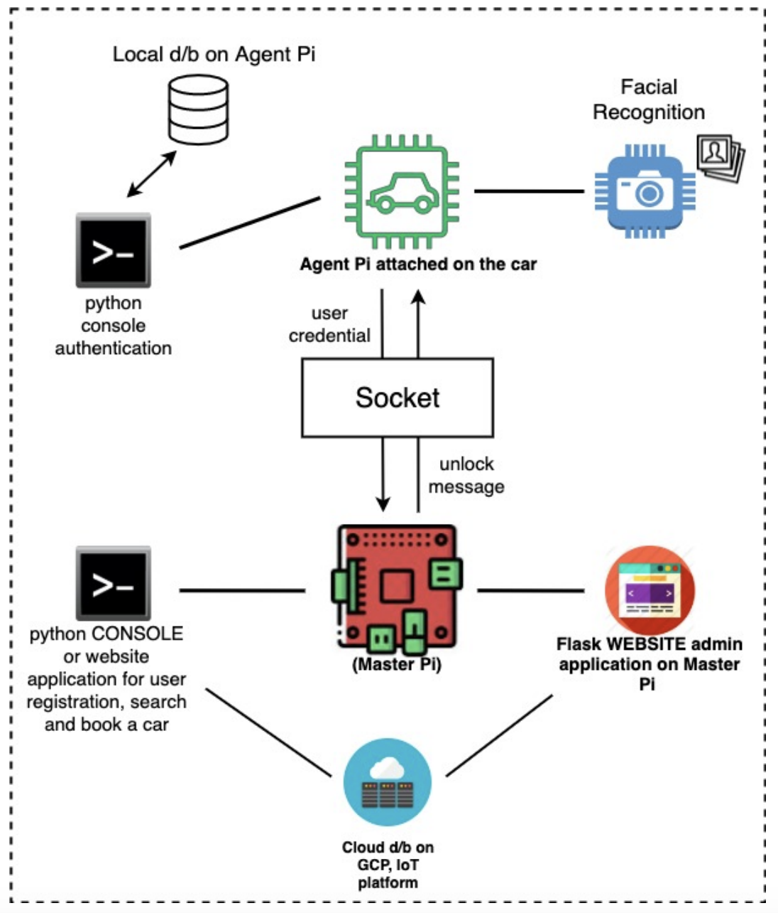

# IoT Car Share System

An automatic car share system which is used to book, find, unlock and lock a car. 
There are four types of users which use this application: 
- Customers: can register, log-in, search and book cars. A booking will automatically be added to the customer's Google Calendar.
They can also unlock a booked-car using
a console-based system or facial recognition AI.

- System administrators: can view car rental history, users, cars, raise an issue with a car for engineers to investigate.

- Company managers: can view traffic related metrics to make better business decision, such as  Daily
active users, percentage of usage for each car per day.

- Engineers: are responsible for repairing cars. Bluetooth is used to automatically unlock a car when an engineer is near it,
and the engineer's QR code is used to store history of maintenance

## Pre-requisites
- Raspberry PI model 4
- Python v3.6+
- Flask (Python framework)
- Google Calendar API access
- GCP IoT access

### Architecture
The high level architecture diagram of the app is as follows:

